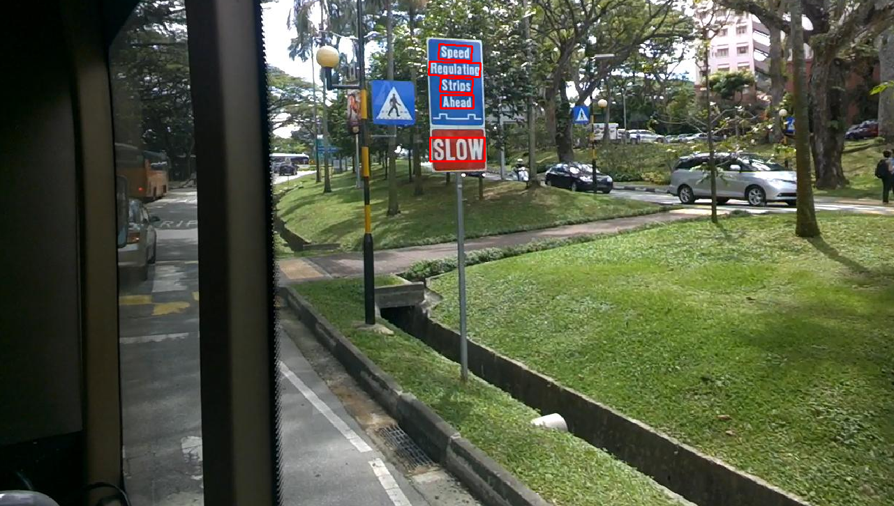
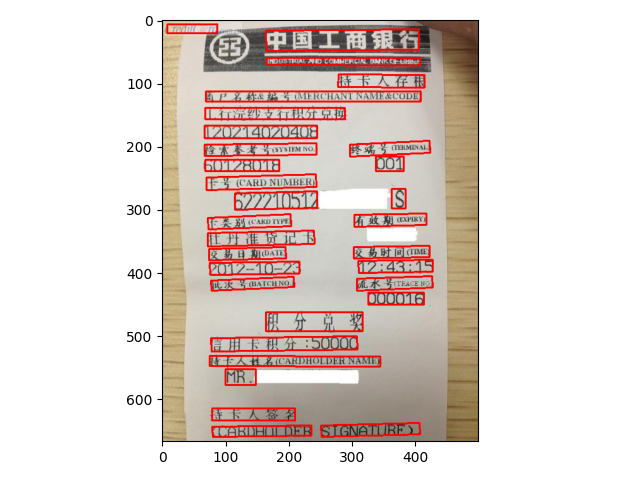

# PytorchOCR

## 简介
PytorchOCR旨在打造一套训练，推理，部署一体的OCR引擎库

**添加微信z572459439或者nsnovio，然后进群讨论。备注ocr进群。**

## 更新日志
* 2021.02.27 添加移动端识别模型文件、移动端DBNet模型文件
* 2021.02.25 添加服务器端识别模型文件
* 2021.02.09 添加DBNet模型，修改DBNet网络结构的fpn，inference时候的缩放及后处理
* 2020.07.01 添加 添加新算法文档
* 2020.06.29 添加检测的mb3和resnet50_vd预训练模型
* 2020.06.25 检测模块的训练和预测ok
* 2020.06.18 更新README
* 2020.06.17 识别模块的训练和预测ok

## todo list
* [x] crnn训练与python版预测
* [x] DB训练与python版预测
* [x] imagenet预训练模型
* [x] 服务器端识别模型文件
* [x] DB通用模型
* [ ] 手机端部署
* [x] With Triton,[推荐使用Savior](https://github.com/novioleo/Savior)

## 环境配置

需要的环境如下
* pytorch 1.4+
* torchvision 0.5+
* gcc 4.9+ (pse,pan会用到)

快速安装环境
```bash
pip3 install -r requirements.txt
```

## 文档教程
* [文字检测](doc/检测.md)
* [文字识别](doc/识别.md)
* [添加新算法](doc/添加新算法.md)

## 文本检测算法

PytorchOCR开源的文本检测算法列表：
- [x]  DB([paper](https://arxiv.org/abs/1911.08947))

| 模型简介 | 骨干网络 | 推荐场景 |大小|  下载链接 |
|  ----  | ----  |  ----  | ----  |----  |
|预训练模型|ResNet50| 服务器端|97.3M|[ 3cmz](https://pan.baidu.com/s/1l4T0KX4W-PFy1EH5Nh9HSA)|
|原始超轻量模型，支持中英文、多语种文本检测|MoblieNet| 移动端|2.3M|[c9ko](https://pan.baidu.com/s/1DpM_HzwYFgAJhjgUtQ7CCw)|
|通用模型，支持中英文、多语种文本检测，比超轻量模型更大，但效果更好|ResNet18| 服务器端|47.2M|[r26k](https://pan.baidu.com/s/1Pt1P0Z8b280AAjr9jLMqeg)|


## 文本识别算法
PytorchOCR开源的文本识别算法列表：
- [x]  CRNN([paper](https://arxiv.org/abs/1507.05717))

| 模型简介 | 骨干网络 | 推荐场景 |大小 |  下载链接 |
|  ----  | ----  |  ----  | ----  | ----  |
|原始超轻量模型，支持中英文、数字识别|MoblieNet| 移动端|4.2M|[7x9q](https://pan.baidu.com/s/1l2BhmrjO1ZtmNw5yWCdPZQ)|
|通用模型，支持中英文、数字识别|ResNet34| 服务器端|106.4M|[sdnc](https://pan.baidu.com/s/1gnFVXHW-nOz1r8c53u-QFQ)|


## 预训练模型下载地址
链接: https://pan.baidu.com/s/1uMWys5lQ5ZfhnaOCPBVqZw  密码: i9du

## 结果展示





## 贡献代码
我们非常欢迎你为PytorchOCR贡献代码，也十分感谢你的反馈。

## 相关仓库
* https://github.com/WenmuZhou/OCR_DataSet
